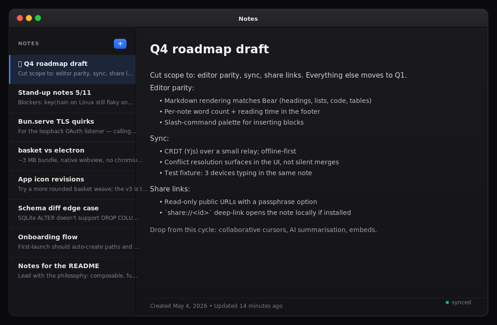

<div align="center">
  <h1>Basket</h1>
  <p>
    <strong>Composable, functional Bun/TypeScript building blocks for desktop apps.</strong><br/>
    What <a href="https://github.com/wess/atlas">atlas</a> is to web apps, basket is to desktop — built on
    <a href="https://github.com/wess/butter">butter</a>.
  </p>
  <p>
    
  </p>
  <p>
    <a href="docs/getting-started.md">Getting started</a> ·
    <a href="docs/concepts.md">Concepts</a> ·
    <a href="docs/api.md">API</a> ·
    <a href="docs/README.md">Docs</a>
  </p>
</div>

---

## Why basket

- **Tiny binaries.** ~3-8 MB, not ~150 MB. Native webview, not bundled Chromium.
- **One language.** TypeScript on the host (Bun) *and* in the webview. No Rust, no Go.
- **Functional.** No classes, immutable inputs, composition over inheritance. Same conventions as atlas.
- **Composable.** 29 small packages. Use one, use them all — they snap together.
- **AI-friendly.** Every package ships an `AGENTS.md` ≤ 200 lines with types, exports, and a working example.
- **No npm tax.** Vendor as a workspace, edit in place, no version skew.

## Quick start

```bash
bunx --bun @basket/cli init myapp --template minimal
cd myapp
bun install
bun run dev
```

A native window opens. ⌘T toggles the theme; ⌘Q quits.

Templates: `minimal` (single-window) and `menubar` (tray-only).

## Packages

<details open>
<summary><strong>Core</strong></summary>

| Package | Purpose |
|---|---|
| [`@basket/config`](packages/config/AGENTS.md) | Typed env vars + platform-correct paths (data, config, cache, logs) |
| [`@basket/store`](packages/store/AGENTS.md) | Local JSON key-value store with atomic writes |
| [`@basket/ipc`](packages/ipc/AGENTS.md) | Typed channels, events, pipelines, validation, structured errors |
| [`@basket/window`](packages/window/AGENTS.md) | Multi-window management with size/position persistence |
</details>

<details open>
<summary><strong>Native shell</strong></summary>

| Package | Purpose |
|---|---|
| [`@basket/menu`](packages/menu/AGENTS.md) | Declarative app and context menus |
| [`@basket/tray`](packages/tray/AGENTS.md) | System tray / menubar items |
| [`@basket/dialog`](packages/dialog/AGENTS.md) | File / folder / message dialogs |
| [`@basket/notify`](packages/notify/AGENTS.md) | OS notifications |
| [`@basket/shortcut`](packages/shortcut/AGENTS.md) | Global keyboard shortcuts |
| [`@basket/protocol`](packages/protocol/AGENTS.md) | Custom URL scheme / deep-link routing |
| [`@basket/lifecycle`](packages/lifecycle/AGENTS.md) | App lifecycle hooks (before-quit, activate, …) |
| [`@basket/theme`](packages/theme/AGENTS.md) | System theme detection + app theme manager |
</details>

<details open>
<summary><strong>Data</strong></summary>

| Package | Purpose |
|---|---|
| [`@basket/db`](packages/db/AGENTS.md) | `bun:sqlite` query builder + schemas + basic migrations |
| [`@basket/migrate`](packages/migrate/AGENTS.md) | Schema-diff + versioned migrations |
| [`@basket/fs`](packages/fs/AGENTS.md) | Sandboxed FS helpers + recents list |
| [`@basket/cache`](packages/cache/AGENTS.md) | TTL'd in-memory + disk cache with cache-aside |
| [`@basket/logger`](packages/logger/AGENTS.md) | File-rotating logger under `paths.logs` |
</details>

<details open>
<summary><strong>Network · Auth · AI</strong></summary>

| Package | Purpose |
|---|---|
| [`@basket/request`](packages/request/AGENTS.md) | HTTP client with retries, interceptors, abort |
| [`@basket/secrets`](packages/secrets/AGENTS.md) | OS keychain (macOS / libsecret / Credential Manager) |
| [`@basket/auth`](packages/auth/AGENTS.md) | Argon2id + OAuth client (PKCE) + keychain sessions |
| [`@basket/update`](packages/update/AGENTS.md) | Auto-update manifest + SHA-verified downloads |
| [`@basket/ai`](packages/ai/AGENTS.md) | OpenAI / Anthropic / Ollama — chat, streaming, embeddings |
| [`@basket/mcp`](packages/mcp/AGENTS.md) | Expose app tools / resources to AI clients via MCP |
</details>

<details open>
<summary><strong>UI · CLI</strong></summary>

| Package | Purpose |
|---|---|
| [`@basket/ui`](packages/ui/AGENTS.md) | React desktop primitives: provider, titlebar, sidebar, palette, toast |
| [`@basket/cli`](packages/cli/AGENTS.md) | The `basket` CLI: `init`, `dev`, `build`, `bundle`, `add`, `docs`, `doctor` |
</details>

## What it looks like

`src/shared/channels.ts` — shared between host and webview:

```ts
import { defineChannel, defineEvent } from "@basket/ipc"
import type { Note } from "./types"

export const listNotes   = defineChannel<void, Note[]>("notes:list")
export const createNote  = defineChannel<{ title: string }, Note>("notes:create")
export const noteCreated = defineEvent<Note>("notes:created")
```

`src/host/index.ts` — host:

```ts
import { defineConfig, ensurePaths } from "@basket/config"
import { column, connect, defineTable, from } from "@basket/db"
import { sync } from "@basket/migrate"
import { emit, handle, notFound } from "@basket/ipc"
import { mainWindow } from "@basket/window"
import { createStore } from "@basket/store"
import { createNote, listNotes, noteCreated } from "../shared/channels"

const config = defineConfig({ app: { name: "Notes", id: "io.wess.notes" } })
const p = await ensurePaths(config.app)

const notes = defineTable("notes", {
  id: column.serial().primaryKey(),
  title: column.text(),
  body: column.text().default(""),
  createdAt: column.timestamp().default("now()"),
})

const db = connect(`${p.data}/notes.db`)
sync(db, [notes])

const settings = createStore("settings", { app: config.app })
const win = mainWindow({ defaults: { width: 1100, height: 720 }, store: settings })

handle(listNotes, () => db.all(from(notes).order("createdAt", "desc")))
handle(createNote, ({ title }) => {
  const created = db.insert(notes, { title })
  emit(noteCreated, created)
  return created
})
```

`src/app/main.ts` — webview:

```ts
import { invoke, subscribe } from "@basket/ipc/client"
import { createNote, listNotes, noteCreated } from "../shared/channels"

const list = document.getElementById("list")!
let notes = await invoke(listNotes, undefined as unknown as void)
render(notes)
subscribe(noteCreated, (n) => { notes = [n, ...notes]; render(notes) })

document.getElementById("new")!.addEventListener("click", async () => {
  await invoke(createNote, { title: "Untitled" })
})
```

End-to-end typed. Renaming `createNote` or changing its payload is a
compile error on both sides.

## Documentation

Comprehensive docs under [`docs/`](docs):

- [Getting started](docs/getting-started.md)
- [Concepts](docs/concepts.md) — host vs webview, channels, immutability, paths
- [Quickstart](docs/quickstart.md) — 80-line working app
- [API reference](docs/api.md) — one-screen cross-package lookup
- [IPC guide](docs/ipc.md) — channels, pipelines, validation, errors
- [Data guide](docs/data.md) — db, migrations, cache, fs, logger
- [Auth guide](docs/auth.md) — passwords, OAuth (PKCE), keychain sessions
- [AI guide](docs/ai.md) — providers, streaming, MCP
- [UI guide](docs/ui.md) — `@basket/ui` components
- [Distribution](docs/distribution.md) — build, bundle, sign, auto-update
- [Testing](docs/testing.md) — unit + integration patterns
- [Troubleshooting](docs/troubleshooting.md) — platform quirks
- [Comparisons](docs/comparisons.md) — vs Electron / Tauri / atlas
- [FAQ](docs/faq.md)
- [Contributing](docs/contributing.md)

## Conventions

Non-negotiable:

- Filenames lowercase, no `-` / `_` / spaces; hierarchy via subdirectories
- No classes. Functional only — closures, factory functions, tagged objects
- Immutable data; transforms return new objects
- Bun-native — `Bun.file`, `bun:sqlite`, `Bun.spawn`, `Bun.$` before any `node:*`
- Wrap butter primitives — don't reinvent IPC / windows / menus
- Biome only — `bun run check` / `bun run tidy`. No Prettier, no ESLint.

See [SOUL.md](SOUL.md) for the full rules.

## Example

[`example/notes/`](example/notes) is a working notes app using db, store,
window, ipc, menu, config. Run it:

```bash
cd example/notes
bun install
bun run dev
```

## Scripts

```bash
bun test            # full suite — runs in ~300 ms
bun run check       # biome lint + format check
bun run tidy        # biome auto-fix
```

## Install

Basket is not on npm. Vendor it as a workspace:

```bash
curl -sL https://github.com/wess/basket/archive/refs/heads/main.zip -o /tmp/basket.zip
unzip -q /tmp/basket.zip -d /tmp/basket-expand
mv /tmp/basket-expand/basket-main ./basket
rm -rf /tmp/basket.zip /tmp/basket-expand
echo "basket/" >> .gitignore
```

Then in your project's `package.json`:

```json
{
  "workspaces": ["basket/packages/*"],
  "dependencies": {
    "butter": "npm:butterframework@latest",
    "@basket/config": "workspace:*",
    "@basket/store": "workspace:*",
    "@basket/window": "workspace:*",
    "@basket/ipc": "workspace:*"
  }
}
```

See [docs/getting-started.md](docs/getting-started.md) for the long version.

## License

[Apache License 2.0](LICENSE) © 2026 Wess Cope

♥ [Sponsor this project](https://github.com/sponsors/wess)
